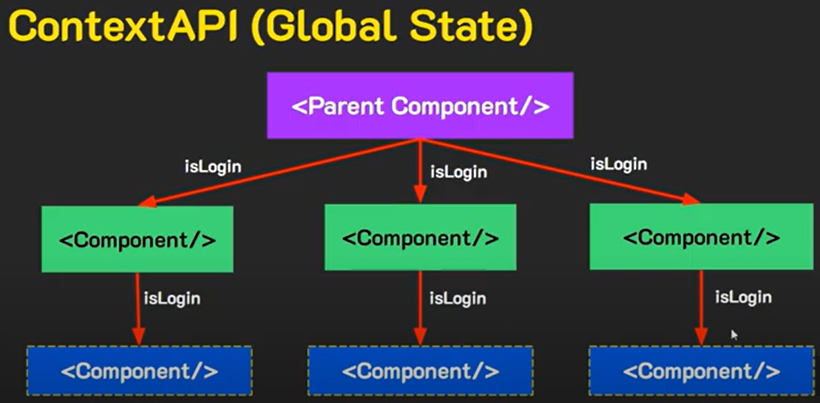

### Children to Parent (Bottom-Up)
เป็นเทคนิคการส่งข้อมูลจาก component ลูกไปหา component แม่

จากในเคสนี้เราต้องการส่งข้อมูลจาก FormComponent ไปให้ Transaction แต่เราจะไม่ส่งไปให้โดยตรง โดยเราจะต้องทำการ**ส่งไปให้ component แม่ก่อนแล้วค่อยส่งให้ Transaction อีกที**โดย component แม่จะต้องมีการสร้าง State มารับข้อมูลที่ส่งไปด้วย

### Context API (Global State)
ในกรณีที่เราไม่อยากใช้วิธี CtP(props) เราสามารถส่งข้อมูลไปยัง component อื่นๆได้โดยการ**สร้างข้อมูลกลางไว้สำหรับแชร์ข้อมูลไปให้ component อื่นๆใช้**โดยทุกๆ component สามารถที่จะเข้าถึงข้อมูลนี้ได้

มีส่วนประกอบ 2 ส่วนคือ
- Provider(Parent) ดูแลจัดการข้อมูลแล้วนำไปส่งให้ consumer
- Consumer(Children) นำข้อมูลที่ได้จาก provider ไปแสดงผลใน component