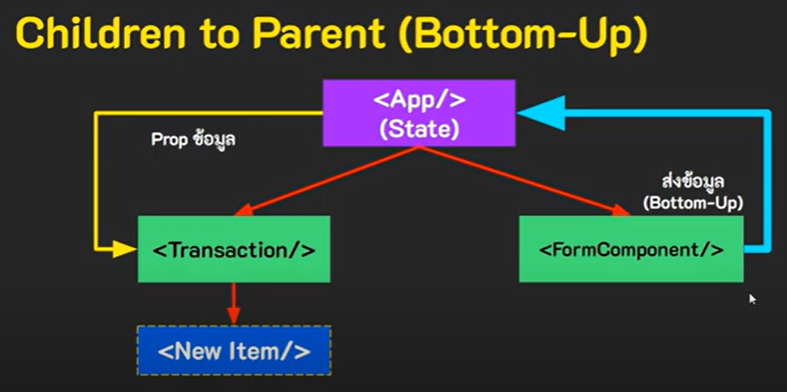

### Children to Parent (Bottom-Up)
เป็นเทคนิคการส่งข้อมูลจาก component ลูกไปหา component แม่

จากในเคสนี้เราต้องการส่งข้อมูลจาก FormComponent ไปให้ Transaction แต่เราจะไม่ส่งไปให้โดยตรง โดยเราจะต้องทำการ**ส่งไปให้ component แม่ก่อนแล้วค่อยส่งให้ Transaction อีกที**โดย component แม่จะต้องมีการสร้าง State มารับข้อมูลที่ส่งไปด้วย
